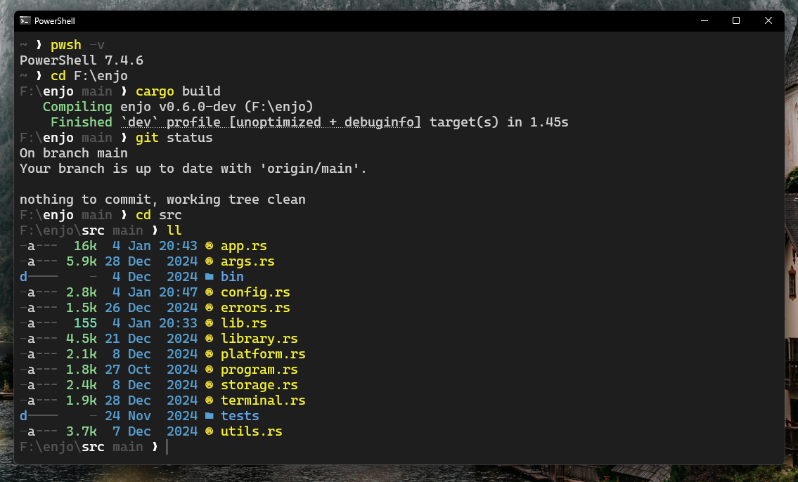

# `velocity`

A pure PowerShell prompt.



## Features

- Minimal style, inspired by [Hydro for Fish Shell](https://github.com/jorgebucaran/hydro).
- Git integration.
- Highlight current directory.
- Lightweight and fast.

## Requirements

- PowerShell 5.1+

## Installation

```powershell
irm "https://raw.githubusercontent.com/kostya-zero/velocity/refs/heads/main/install.ps1" | iex
```

## License

This project is released under the [MIT License](./LICENSE.md).